#  Arquitectura TP2 
En este informe se detalla la arquitectura del sistema distribuido que se encargará de hacer las consultas para el sistema de recomendación de libros de Amazon, todo mientras es tolerante a fallas de los nodos. Tenemos como fin que se trate de un sistema escalable por lo que se ha utilizado una arquitectura de pipe and filter, con lo que cada nodo del sistema anidará múltiples workers que realizarán en paralelo la tarea de un filtro. 

##  Integrantes 
-  Diego Civini 
-  Facundo Aguirre Argerich 

##  Sistema completo 
En la siguiente imagen se puede ver como sera la estructura del sistema completo.  

 

En el TP1 teniamos una estructura en donde varios workers de un mismo stage leian de una misma cola y luego escribian en una misma cola. De esta manera da uno iba agarrando mensajes a medida que estuviese disponible. Pero para este TP, se pedia implementar multiples clientes paralelos. Con nuestra vieja estructura esto se nos hacia muy dificil de coordinar y nos traia mas problemas que comodidades. Es por eso que se decidio cambiar toda la estuctura. Para este nuevo TP, cada worker tiene su cola de salida como de entrada. No sucede mas que varios workers leen en una misma cola o escriben en una misma cola. De esta manera, la coordinacion de los EOFs y demas mensajes se hace mucho mas simple, ya que no existe el problema de que un worker le robe un EOF a otro worker. Procedemos a mostrar mas de cerca como se veria por ejemplo la Q1 con esta nueva estructura.

 

En la Q1 ahora tenemos 9 colas (y esto porq hay 9 workers porque si hubiese mas, habria mas colas) donde antes habria solo 3 colas (sin importar la cantidad de workers). 

Con esta nueva estructura, hay que tener una manera de saber a que worker mandar el mensaje y como manejar los EOFs. Para entender esto, tenemos los siguiente ejemplos.

####  Comunicacion con multiple colas 
Supongamos una situación donde tenemos 2 filtros los cuales están compuestos por múltiples workers cada uno, a modo de ejemplo usaremos 3 workers.
Incialmente tendremos una configuración en la que si bien cada worker
sabe el nombre de su cola de entrada, no sabe el nombre de la de salida.

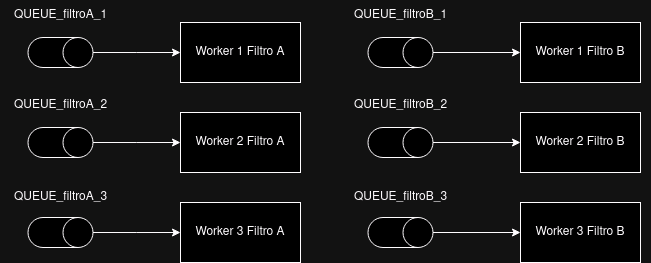 
  

Llega un mensaje a la cola del worker 1 del filtro A, entonces se dispone a ver a quien debe mandárselo.
Utilizando configuraciones iniciales sabe que debe mandarlo a la cola de del filtro B, pero... ¿A qué worker?

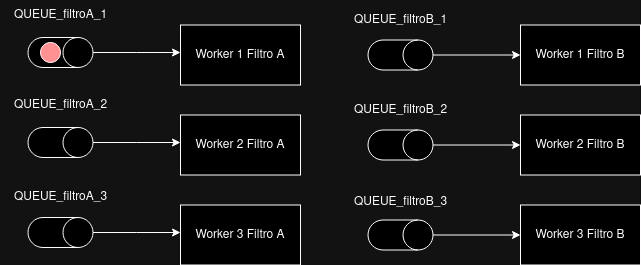 
 

Para poder decidir a qué worker se lo va a mandar de manera que la carga se encuentre bien
distribuida entre ellos necesitamos una manera de que se considere el módulo o cantidad de
workers que se tiene en la siguiente capa de workers y que la decisión de uno entre ellos sea
igual de probable que el resto. ¡Para eso sirven las funciones de hashing! 
Entonces para poder saber a qué worker mandará el mensaje decide un número que estará 
en el rango de ID's de los workers del siguiente filtro utilizando una función de hashing  a
la que se le puede especificar este módulo. Con eso tendríamos una distribución correcta
 de los mensajes enviados.
Asumamos que el hasheo de la primary key de la información nos dió 2 a fines de ejemplificar.

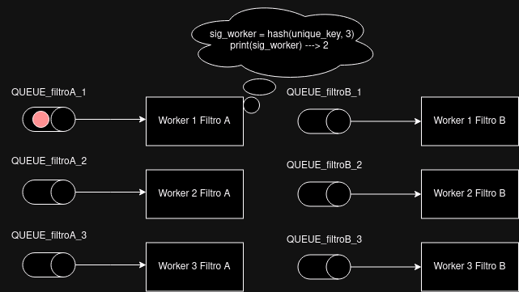 
 

Una vez que sabe el ID del worker al mandará el mensaje, concatena ese ID para completar el nombre
de la cola que se utilizará para la comunicación mediante el middleware y envía el mensaje a esa cola.
Luego el siguiente filtro repetirá todo este procedimiento de la misma manera hasta llegar al final del
pipeline y realizar una comunicación de muchos a uno (explicación en otro apartado)

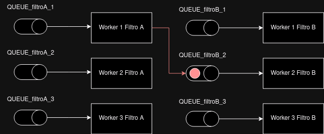 

####  Manejo de EOFs con multiple colas 
Para el caso de la recepción e interpretación de los EOF's o finalización de una operación,
el cliente del que venga el EOF en medio de la comunicación es indistinto a menos que se trate
de un acumulador de resultados que requiera de un estado acumulado para poder retornar el 
resultado final a ese cliente. Por el momento nos centraremos en explicar como funciona el
mecanismo de EOF para múltiples workers con una cola cada uno.
Se trata de un mecanismo bastante simple; Supongamos la configuración detallada arriba, 
con dos filtros de 3 workers cada uno que procesan la información que les llega.

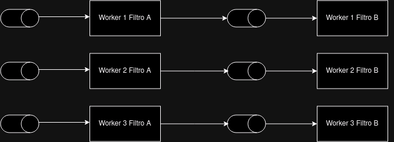 
  

Cuando le llega un eof a cualquiera sea el worker de un filtro, este necesita esperar a cierta cantidad de EOF, correspondiente
a la cantidad de  workers del filtro pasado (configurado automáticamente de antemano). Entonces para poder enviar el EOF al
siguiente filtro primero debe contar esa cantidad de mensajes EOF  de manera que hasta que todos los workers del filtro anterior
no hayan terminado, no terminarán todos los workers de mi filtro actual.
Ahora entra un EOF al Worker 1 del Filtro A, asumiendo que este filtro solo necesita 1 EOF para terminar, empieza el proceso de 
mandar los EOFs al siguiente filtro, entonces deposita un EOF en cada cola del siguiente filtro

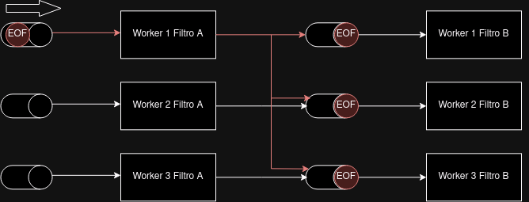 
 

De manera análoga llegan EOFs tanto al worker 2 como el 3 hasta que cada uno mandó 
un EOF a cada worker del siguiente filtro, completando los EOFs esperados por ese 
filtro en cada worker y permitiendo que se repita este proceso.

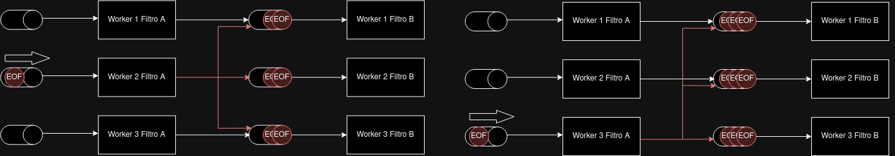 

####  Server 
El server es nuestro boundary object, y con el agregado de multiples clientes se le hicieron unos cambios. Por cada conexion de un cliente nuevo, el server lanza un proceso llamado DataFordwarder que se encarga de recibir los datos del cliente por TCP y pasarselos por una cola de Rabbit a el QueryCoordinator. Ademas de eso lanza un proceso llamado ResultFordwarder, este es unico y se encarga de recibir los resultados desde el QueryCoordinator y enviarselos al cliente correspondiente.

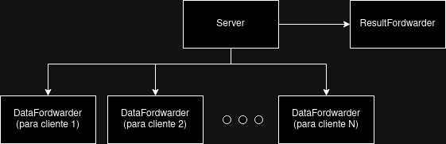 

####  QueryCoordinator 
Del lado del QueryCoordinator pasa algo similar. Recordemos que este worker se encarga de parsear los datos de los clientes dependiendo de lo que necesite cada pipeline y en la parte de resultados, se encarga re juntar todos los resultados del cliente, formatearlos debidamente y enviarlos. Para esto, ambas funcionalidades se dividen en 2 procesos. El ResultsCoordinator y el DataCoordinator.

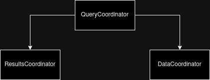 

####  Conexion Server-QueryCoordinator 
Asi se veria como estan conectados ambos workers para la entrada y salida de datos del sistema.

##  Diagrama de robustez 
A continuación podemos observar el diagrama de robustez que nos indica cómo se relacionan las entidades del sistema y la manera de comunicación entre ellas mediante boundaries, controllers y entities.  

##  Diagrama de despliegue 
En el diagrama de despligue podemos ver como se agrupan los diferentes nodos del sistema en diferentes grupos y como se comunican entre ellos.

 

##  Diagrama de logica de Fallas 
En nuestro sistema tenemos varios tipos de workers, y cada tipo es distinto a la hora de manejar las fallas. La mayoria podemos encasillarlos en 2 tipos distintos. Por un lado tenemos la abstraccion Worker. En esta se encuentran la mayoria de los workers del sistema, y podemos dividirla en 2 sub-abstracciones. Por un lado el NoStateWorker, en el cual podemos encontrar workers que no tienen estado de resultados ya que lo unico que hacen es filtar o modificar datos (por ejemplo los filtros de titulos, categorias, etc). La otra sub-abstraccion es el StateWorker que en este caso si tiene un estado por cada cliente en el que va acumulando resultados (por ejemplo el worker que genera el percentil o el que consigue los tops).
El otro tipo importante es el MultipleQueueWorker. En la abstraccion que hablamos antes, los datos son recibidos por una sola cola. En el MultipleQueueWorker los datos son recibidos por mas de una cola. Esto provoca que se tengan que tener mas consideraciones a la hora sincronizar datos ya que un cliente no termina hasta que se terminen los datos de todas las colas sobre ese cliente. Este tipo de worker lo podemos ver en los JoinWorkers y el ResultsCoordinator. Por ejemplo, en el JoinWorker se reciben datos de 2 colas, una de titulos y otra de reseñas. Entonces para un mismo cliente, el sistema debe aguardar que llegen todos los datos de ambas colas para poder decir que termino con ese cliente.

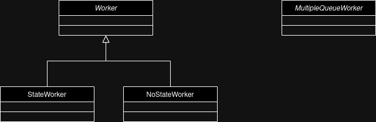 

###  NoStateWorker 
Empezamos con uno de los mas simples. El NoStateWorker. Por cada mensaje que recibe, primero debe fijarse si se trata de un mensaje de EOF o un mensaje de datos. Si es un mensaje de datos, debe fijarse el id del mismo (msg_id) y del cliente. Si para ese cliente ya se habia recibido un mensaje con ese msg_id, entonces se esta recibiendo un mensaje repetido. En este caso directamente se le hace ack inmediatamente ya que no nos sirve para nada mas. En caso contrario, hay que guardarse ese msg_id. A partir de ahi, si el mensaje es de un cliente nuevo, este tendra un client_id que no se tenia registrado en _active_clients_. Una vez registrado se escribe en memoria el nuevo _active_clients_ y se procede a procesar, enviar y ackear el mensaje. 
Por el lado del EOF, para chequear repetidos, cada mensaje EOF contiene el id del cliente y el id del worker de donde viene. De esta manera si me llega un EOF del cliente con id 4 desde el worker con id 0, ya se que para ese mismo cliente no me puede llegar un EOF desde ese mismo worker. Cada delivery_tag de los EOF es guardado hasta que lleguen todos los EOFs necesarios (el manejo de los EOFs esta explicado al principio en la seccion **Sistema Completo**). Una vez que sucede, se mandan los EOFs a la siguiente etapa, se actualiza en disco el _active_clients_ y se hace ACK de todos los EOFs que se habian acumulado.

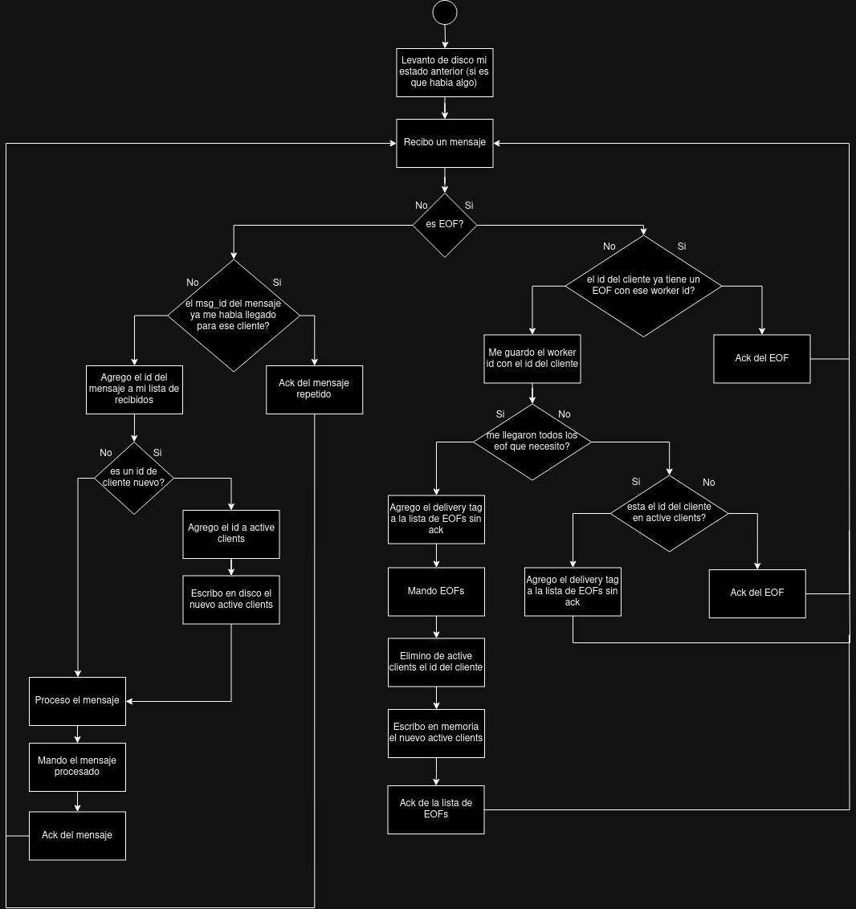 

###  StateWorker 
Dentro de la misma familia donde se ecuentra NoStateWorker, encontramos al StateWorker. Estos a diferencia de la abtraccion anterior, por cada cliente acumulan los mensajes hasta que le lleguen los EOFs necesarios. Es en ese momento cuando mandan su acumulado seguido de un EOF. Como podemos ver tambien empieza fijandose si recibio un EOF o un mensaje dee datos y se fija el id del mensaje para ver si es repetido. Todo eso es igual a en el worker anterior. Cuando es un mensaje de datos, la logica si cambia. En este caso, los workers acumulan N mensajes. Acumular significa agregar los datos nuevos al acumulado de datos de ese cliente, guardarse el delivery_tag para luego hacerle ACK y guardarse el msg_id para poder detectar duplicados en el futuro. Una vez que le llega el mensaje N, persiste todos esos datos a disco y hace ACK de todos los mensajes acumulados.
Con los EOFs la primera parte es igual que en el NoStateWorker. Pero una vez que llegan todos los EOFs necesarios, hay que hacer un par de cosas mas. Lo primero es chequear si quedaron mensajes sin hacerles ACK. Anteriormente dijimos que cuando llega el mensaje N, se le hace ACK a todos los mensajes acumulados. Pero si llegaron M mensajes, con M < N, y despues empiezan a llegar los EOFs, hay M mensajes los cuales nunca van a ser ackeados ni persistidos a disco. Es por eso que hacemos este chequeo. Una vez hecho el chequeo, se manda el acumulado, el EOF y se le hace ACK a todos los EOFs acumulados.

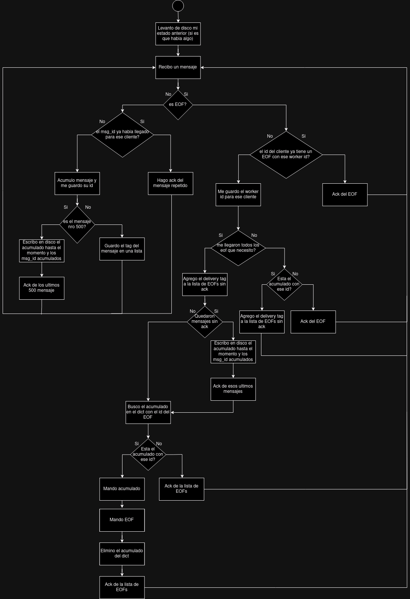 

###  MultipleQueueWorker 
Ahora si, con la otra familia de workers. Como dijimos, estos se encargan de recibir datos de mas de una cola al mismo tiempo. Por el lado de los mensajes de datos, es igual que el StateWorker, ya que estos tambien son acumuladores. La unica diferencia en este sentido es que acumulan N mensajes por cola. Osea si uno de estos workers recibe por 2 colas, en ambas va a teener su contador y si en una llega a los N mensajes, se ackean los N mensajes solo de esa cola, los acumulados de la otra cola no.
En el manejo de los EOFs, si se hacen las cosas diferentes. Si me llegan todos los EOFs de una cola antes sifnificaba que eel cliente ya habia terminado entonces se podian mandar los reesultados. En este caso, hay que chequear si tambien llegaron los EOFs de las demas colas. Entonces cada vez que en una cola llegan todos los EOFs se chequea si ya sucedio eso tambien en las demas colas. Si no sucedio, se marca como terminada esa cola y se sigue normal. Pero si ya sucedio, entonces signfica que todos estaban esperando a que termine esa cola y que ya se puede enviar los resultados acumulados de ese cliente.

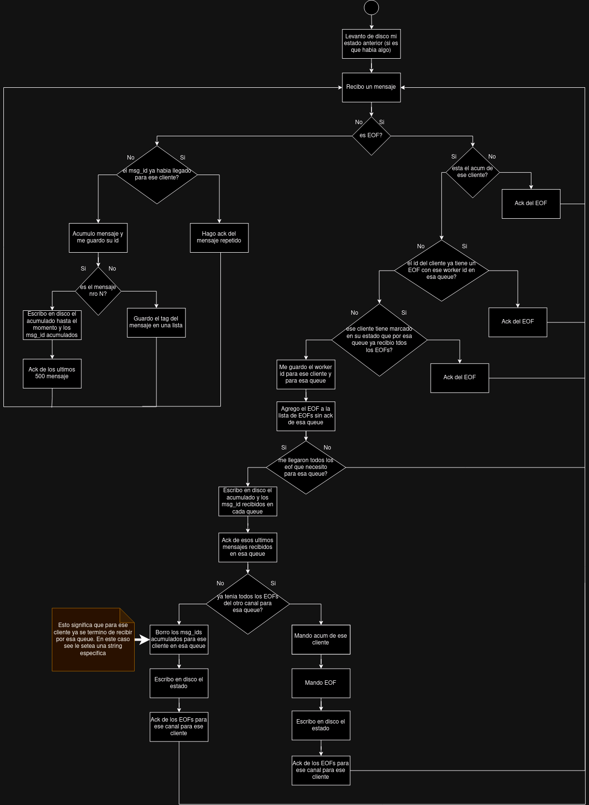 

###  Casos particulares 
En el sistema hay algunos casos que no se pudieron encasillar en las abstracciones mencionadas anteriormente ya que eran muy particulares. Estos estan en el Server (nuestro boundary object) y en uno de los procesos del QueryCoordinator, el DataCoordinator.

####  DataCoordinator 
Como explicamos antes, el QueryCoordinator tiene 2 partes, el ResultCoordinator y el DataCoordinator. El ResultCoordinator recibe todos los resultados de varias colas y es por eso que hereda funcionalidad de la abstraccion MultipleQueueWorker. Pero el DataCoordinator tenia sus particularidades y es unico. En la parte de los EOFs es igual a los demas. Por cada EOF se guarda su delivery_tag y cuando le llegan todos, sabe que el cliente termino. En este caso, por cada cliente le tienen que llegar 2 EOFs, el primero indica que ya se mandaron todos los titulos y el segundo indica que ya se mandaron todas las reseñas. El DataCoordinator se guarda esta informacion por cada cliente. Si ya le llego el EOF de titulos marca al cliente como que esta en modo reseñas. En este modo, sabe que si llega un EOF de titulos, se trata de un EOF repetido. Con la llegada de mensajes, el parse mode (titulos o reseñas) es importante ya que le indica como debe parsear los mensajes para mandarselo a cada query. Todo esto se va persistiendo en disco antes de hacerle ACK a los mensajes.

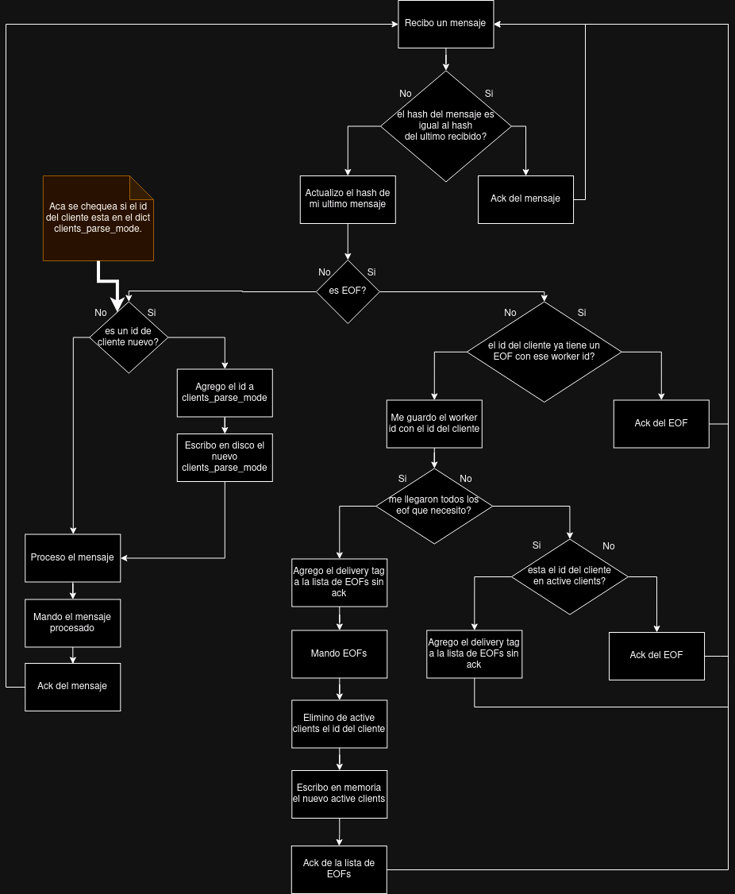 

####  Server 
El Server es nuestro boundary object, por ende usa TCP para comunicarse con los clientes y esto trae nuevas consideraciones. Como mencionamos antes, el Server tiene 2 procesos principales, el ResultFordwarder y el DataFordwarder.

El DataFordwarder es el mas simple. Se crea uno de estos procesos por cada cliente conectado y recibe todos los datos de ese cliente. Por cada mensaje recibido por TCP, manda un ACK tambien por TCP al cliente. Una evez que ya se mandaron todos los mensajes, el proceso termina. Pero hay que tener una cosa en cuenta, que pasa si el cliente ya mando todos sus mensajes, el proceso DataFordwarder de ese cliente termino y se cae el server. En este caso, cuando se levante el server y se vuelva a conectar el cliente, el server tiene que saber si ese cliente tiene todavia datos para mandar entonces hay que crearle un DataFordwarder o si ya termino de mandar sus datos entonces no hay que crearle un DataFordwarder. Esto el server lo sabe mirando el estado del cliente. Como podemos ver en el diagrama, el DataFordwarder cuando ya termino con el cliente, actualiza el estado del clieente en disco para que despues se sepa si el cliente esta en un estado en el cual espera resultados o en un estado en el cual todavia debe enviar datos.

Por el lado del ResultFordwarder, este recibe por una multiprocessing Queue los sockets de los clientes a los que debe mandarle resultados. Si le llegan los resultados de un cliente, se los envia y lo borra del estado en disco. Todo esto mientras le haya llegado el socket del cliente. Si no le llego, significa que todavia el cliente no se volvio a conectar. El sistema le da 10 segundos al cliente para volver a conectarse. Si no lo logra, sus resultados seran desechados y su estado eliminado, entendiendo que el cliente fallo y que si quiere el serevicio debera mandar todos los datos devuelta.

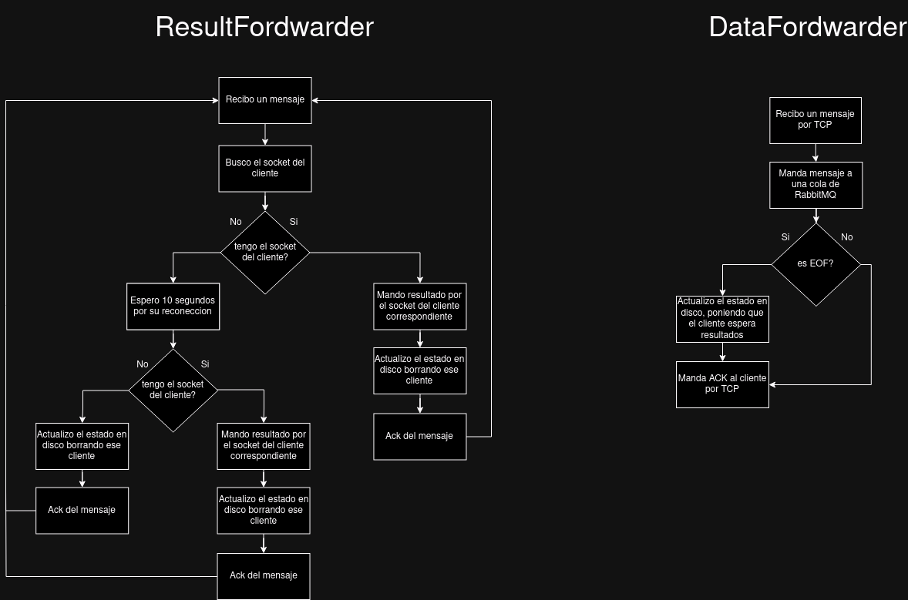 

##  Container Coordinators y Elección de Líder 
En el sistema, para poder manejar las caídas de los nodos o containers que se puedan dar en complemento a la lógica de fallos que mantiene el estado luego de una caída, se implementó una abstracción llamada ContainerCoordinator. Esta abstracción se encarga de manejar en simultáneo a todos los contenedores del sistema mediante "HealthChecks" y de elegir un líder entre ellos tanto en la secuencia de inicio como cuando muere el líder actual.  
El líder es el encargado de manejar el HealthChecking con todo el resto de contenedores del sistema (exceptuando el cliente ya que es una simulación de uno ajeno al sistema).  
En caso de que el líder caiga, alguna replica ContainerCoordinator se encargará de performar una elección de líder de manera que a pesar de que se caiga quien verifica el estado del sistema, siempre haya alguien que lo pueda hacer mientras se levanta el que se cayó.  
###  Conexión entre Container Coordinators 
Para la conexión entre instancias de esta abstracción se decidió utilizar TCP/IP para poder comunicarlos y tener una certeza sobre los estados del socket actual con el que se está comunicando, de manera que sea notable si alguna conexión se cayó y se pueda proceder con la elección de líder.  
Dicha conexión consta de 3 partes:
- **Reconexión**: Al comenzar la ejecución, obligatoriamente verificará si tiene entre sus conexiones existentes a todos los demás ContainerCoordinator, en caso de no tenerlos se reconectará con todos ellos.
- **Extremo de escucha**: Una vez establecida una conexión, cada ContainerCoordinator tiene un extremo de escucha que se encarga de recibir mensajes de los demás ContainerCoordinator y de responder a los mensajes que le llegan. Esto incluye la lógica de propagación de la elección de líder y autoproclamación de líder.
- **Recepción de futuras conexiones**: En todo momento mientras hace el handling de conexiones ya establecidas en un proceso aparte, el ContainerCoordinator está escuchando para poder establecer nuevas conexiones con otros ContainerCoordinator que se puedan levantar en el futuro, por ejemplo si se cayó previamente alguno de ellos.    

Para poder lograr la sincronización entre dichos procesos, mantener y actualizar el estado de las conexiones junto a los sockets de las mismas, se decidió utilizar la abstracción útil que posee mecanismos de sincronización dentro de sí, _**Manager**_ que nos provee de clases estándar de Python como _**Dict**_ que nos permiten mantener la integridad de los datos y la sincronización a través de los procesos.  
###  Elección de Líder 
Para la elección de líder se decidió implementar el algoritmo de elección de líder de Bully. Este algoritmo se basa en que cada ContainerCoordinator tiene un ID único y cuando uno detecta que el líder actual no está respondiendo, le envía un mensaje de elección a todos los demás que tengan un ID mayor al suyo. Estos propagarán la elección de manera análoga a todos sus mayores hasta que el mensaje llegue a quien tiene mayor ID entre los coordinadores y este al ver que nadie más de ID mayor le responde (O la conexión está muerta), se autoproclama líder y lo comunica a todos los demás mediante un mensaje de COORDINATOR.  

En caso de recibir un mensaje `COORDINATOR <id>`, el ContainerCoordinator va a actualizar estados como el de si él mismo es líder o no y si debe cerrar los recursos que actualmente está utilizando para comunicarse con todo el sistema para los HealthChecks, asegurando así una transición correcta de líderazgo.  

En cambio si es él quien debe convertirse en el líder, después de autoproclamarse y comunicarlo al resto actualizará los mismos estados pero en favor de ser líder y comenzará instantáneamente a intentar establecer HealthChecks con los demás coordinadores (por ende levantando al líder anterior que cayó) y los containers del sistema.  

###  HealthChecks 
Los HealthChecks son mensajes que se envían entre los ContainerCoordinator y con el resto del sistema para verificar que todos los contenedores del sistema estén activos y respondiendo. Estos mensajes se envían cada cierto tiempo y si no se recibe respuesta en un tiempo determinado, se considera que el contenedor que no respondió está caído y se procede con el reinicio del mismo. De todas maneras, al handling o recepción de HealthChecks podemos dividirlos en aquellos que realizan los coordinadores que poseen timeouts y aquellos que realiza el resto del sistema (Server, QueryCoordinator, Workers) que no poseen timeout y simplemente responden a los mensajes de HealthCheck que les llegan.
####  HealthChecker 
La abstracción HealthChecker se encarga de enviar mensajes de HealthCheck a los ContainerCoordinator y de recibir los mensajes de respuesta de los mismos. En caso de que no reciba respuesta en un tiempo determinado, se considera que el contenedor con el que se estaba comunicando está caído y se procede con su reinicio.  
- Si el chequeo es hacia un coordinador se tiene menos tolerancia o espera respecto a la conexión inicial que se hace para intercambiar mensajes, esto es debido a que los ContainerCoordinator son los encargados de manejar los HealthChecks, por lo que si uno está caído tiene prioridad al reinicio para garantizar una mejor disponibilidad en el sistema y que haya activas la mayor cantidad de réplicas de este tipo posibles.  
- En cambio con los workers se tiene un poco más de tolerancia para el establecimiento de la conexión ya que los mismos pueden estar cargando o procesando cierta información que demore el handling de la conexión, por lo que antes del reinicio se espera un poco más.  

El _**mecanismo de conexión inicial**_ que se utiliza es _**reconnection with exponential backoff**_ el cual consiste en que si no se logra establecer la conexión con el contenedor en un tiempo determinado, se espera un tiempo exponencialmente mayor al anterior intento para volver a intentar la conexión. Esto se hace para evitar saturar al contenedor con intentos de conexión fallidos y para darle tiempo a que se levante si es que se cayó. La cantidad de intentos varía, como se mencionó en el párrafo anterior, según si el contenedor es un coordinador o no.

####  HealthCheckHandler 
Esta abstracción se encarga de recibir y responder los HealthChecks que manda el HealthChecker. Debería haber una instancia en cada Worker, Server, QueryCoordinator y ContainerCoordinator para poder recibir chequeos en todo momento desde el comienzo de su ejecución.  
Tenemos dos tipos de handling:
- **Handling de HealthChecks con timeout**: En este caso, utilizado principal y únicamente por ContainerCoordinators, se tiene un tiempo determinado para responder al HealthCheck, si no lo hace en ese tiempo se considera que está caído y se procede con una elección de líder antes explicada de manera que se propague la noticia de que cayó el líder así como la elección para tener uno nuevo lo antes posible.
- **Handling de HealthChecks sin timeout**: En este caso, utilizado por el resto del sistema, simplemente se responde al mensaje de HealthCheck que llega y se actualiza el estado de la conexión con el contenedor que lo envió. En caso de que se interrumpa la conexión de healthchecking, el levantamiento y elección se manejará entre coordinadores, por lo que no es responsabilidad hacer ningún tipo de elección ni nada, solo esperar por una nueva conexión en la misma instancia de HealthCheckHandler por el nuevo coordinador que venga.  

Para poder lograr que cualquier container se dé cuenta de que la conexión se cayó, de nuevo, se utiliza TCP/IP para poder tener una certeza de que la conexión se cayó y no se está recibiendo nada. Al haber conexión en este protocolo se asegura que al momento que se termina la misma habrá una excepción al intentar enviar o recibir algo de un socket que ya no está conectado.

## **Protocolo de comunicacion y serialiazacion**
En cuanto a la serializacion, sigue siendo igual de como se explico en el TP1. Pero se hicieron un par de agregados. Primero, se necesitaba una forma de identificar los mensajes de los distintos clientes que estan en paralelo. De esto se encarga el Server. Por cada conexion que recibe de un cliente nuevo, el Server le asigna un id que es un valor incremental. Desde ahi, cada mensaje recibido de ese cliente tiene delante el id del cliente. De esta manera, cada worker sabe que cuando recibe un mensaje debe separar lo que es el contenido del mensaje con el id del cliente.
Ademas de este id del cliente, cada mensaje tiene un id propio. Este id nace desde la libreria que tiene el cliente, la cual le agrega un id al mensaje antes de mandarlo para que despues cuando el server haga ACK, este sepa de que mensaje se esta hablando. Este id luego se usa en el sistema para que los workers los usen para identificar mensajes repetidos en caso de que los haya.
Entonces, cada worker cuando le llega un mensaje sabe que tiene que sacarle el id del mismo y el del cliente. Todo esto se hace con una misma funcion del modulo de serializacion.
