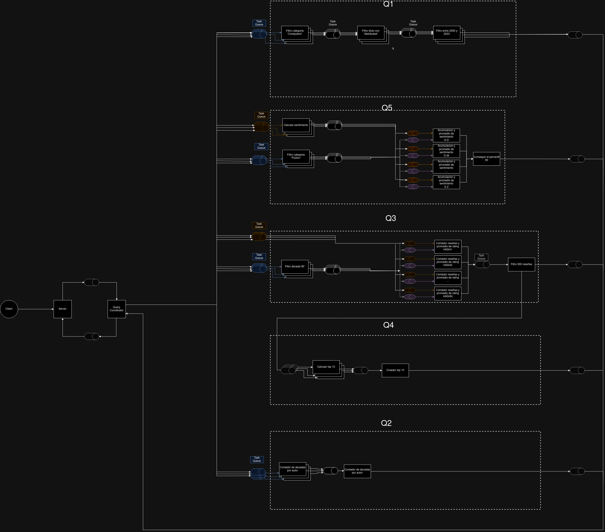
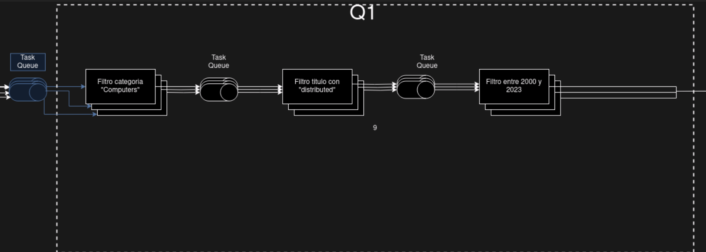

#  Arquitectura TP2 
En este informe se detalla la arquitectura del sistema distribuido que se encargará de hacer las consultas para el sistema de recomendación de libros de Amazon, todo mientras es tolerante a fallas de los nodos. Tenemos como fin que se trate de un sistema escalable por lo que se ha utilizado una arquitectura de pipe and filter, con lo que cada nodo del sistema anidará múltiples workers que realizarán en paralelo la tarea de un filtro.  
También hemos decidido que en el sistema las consultas se harán _X (secuencial/paralelo)_ por las ventajas y desventajas plasmadas en la siguiente tabla:

##  Integrantes 
-  Diego Civini 
-  Facundo Aguirre Argerich 

##  Sistema completo 
En la siguiente imagen se puede ver como sera la estructura del sistema completo.  

 

En el TP1 teniamos una estructura en donde varios workers de un mismo stage leian de una misma cola y luego escribian en una misma cola. De esta manera da uno iba agarrando mensajes a medida que estuviese disponible. Pero para este TP, se pedia implementar multiples clientes paralelos. Con nuestra vieja estructura esto se nos hacia muy dificil de coordinar y nos traia mas problemas que comodidades. Es por eso que se decidio cambiar toda la estuctura. Para este nuevo TP, cada worker tiene su cola de salida como de entrada. No sucede mas que varios workers leen en una misma cola o escriben en una misma cola. De esta manera, la coordinacion de los EOFs y demas mensajes se hace mucho mas simple, ya que no existe el problema de que un worker le robe un EOF a otro worker. Procedemos a mostrar mas de cerca como se veria por ejemplo la Q1 con esta nueva estructura.

 

En la Q1 ahora tenemos 9 colas (y esto porq hay 9 workers porque si hubiese mas, habria mas colas) donde antes habria solo 3 colas (sin importar la cantidad de workers). 

Con esta nueva estructura, hay que tener una manera de saber a que worker mandar el mensaje y como manejar los EOFs. Para entender esto, tenemos los siguiente ejemplos:

##  Diagrama de robustez 
A continuación podemos observar el diagrama de robustez que nos indica cómo se relacionan las entidades del sistema y la manera de comunicación entre ellas mediante boundaries, controllers y entities.  

##  Diagrama de despliegue 
En el diagrama de despligue podemos ver como se agrupan los diferentes nodos del sistema en diferentes grupos y como se comunican entre ellos.

 

## **Protocolo de comunicacion y serialiazacion**
En cuanto a la serializacion, sigue siendo igual de como se explico en el TP1. Pero se hicieron un par de agregados. Primero, se necesitaba una forma de identificar los mensajes de los distintos clientes que estan en paralelo. De esto se encarga el Server. Por cada conexion que recibe de un cliente nuevo, el Server le asigna un id que es un valor incremental. Desde ahi, cada mensaje recibido de ese cliente tiene delante el id del cliente. De esta manera, cada worker sabe que cuando recibe un mensaje
