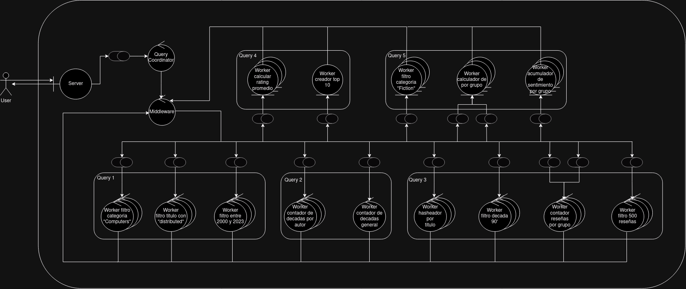
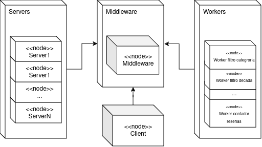

#  Arquitectura TP1 
En este informe se detalla la arquitectura del sistema distribuido que se encargará de hacer las consultas para el sistema de recomendación de libros de Amazon. Tenemos como fin que se trate de un sistema escalable por lo que se ha utilizado una arquitectura de pipe and filter, con lo que cada nodo del sistema anidará múltiples workers que realizarán en paralelo la tarea de un filtro.  
También hemos decidido que en el sistema las consultas se harán _X (secuencial/paralelo)_ por las ventajas y desventajas plasmadas en la siguiente tabla:

|  Modelo/Aspecto  | Ventajas                                                                                                                                                                                                                                                                                                  | Desventajas                                                                                                                                                                                                                                                                                                                                                                |   |   |
|----------------|-----------------------------------------------------------------------------------------------------------------------------------------------------------------------------------------------------------------------------------------------------------------------------------------------------------|----------------------------------------------------------------------------------------------------------------------------------------------------------------------------------------------------------------------------------------------------------------------------------------------------------------------------------------------------------------------------|---|---|
| Secuencial     | - El pasaje del mensaje es directo, la respuesta se puede ensamblar mientras se procesa la query - Las operaciones CPU intensive se soportan más ya que la query se procesa una a la vez - Es más escalable ya que utilizamos la misma cantidad de líneas de comunicación y solo cambia la consulta | - Se tiene que cargar toda la información completa para cada query - No se paraleliza el procesamiento de todas las queries a la vez, aumentando el tiempo total requerido - Aumenta el volumen de mensajes en la red al pasar los mismos mensajes de información por cada query que hay                                                                             |   |   |
| Paralelo       | - Se realizan las queries en paralelo por lo que se optimiza el tiempo total de consulta - Tenemos toda la información cargada en memoria y se lee al mismo tiempo para todas las queries - Los mensajes respectivos al pase de información de facilitan a las consultas al mismo tiempo            | - Ensamblar las respuestas requiere de más handlers de respuesta, ya que no podemos hacer un pasaje directo de rresultados en procesamiento - Las operaciones CPU intensive se corren en paralelo, por lo que se utilizan más recursos que en secuencial - Se reduce la escalabilidad ya que deberíamos hacer una línea de comunicación por cada query nueva deseada |   |   |
|                |                                                                                                                                                                                                                                                                                                           |                                                                                                                                                                                                                                                                                                                                                                            |   |   |

##  Integrantes 
-  Diego Civini 
-  Facundo Aguirre Argerich 

##  Sistema completo 
En la siguiente imagen se puede ver como sera la estructura del sistema completo.  

 

Empezando por el cliente y el server, el primero se conecta mediante TCP a nuestro server el cual tiene como funcion recibir los datasets y mandarle cada batch a al query coordinator. Este se encargara de parsear cada batch para cada pipeline ya que estos usan distintas columnas del dataset. El query coordinator manda los datasets por diferentes queues,donde cada una va a una query distinta. Ademas, Query Coordinator se encarga de recibir por distintas colas los diferentes resultados de cada pipeline. 

 

Cada pipeline se encarga de conseguir lo resultados de una query en especifico y eso lo hacen usando diferentes tipos de workers que se encargan de aplicarle un simple tipo de "job" a cada dato recibido.  

**Query 1**: _Título, autores y editoriales de los libros de categoría "Computers" entre 2000 y 2023 que contengan 'distributed' en su título._  
Este pipeline recibe los datos de los titulos y los pasa por 3 diferentes pools de workers en los que cada pool tiene un filtro distinto a aplicar.

 
 

**Query 2**: _Autores con títulos publicados en al menos 10 décadas distintas._  
Como en la query anterior, solo se reciben los datos de los titulos los cuale son adquiridos por un pool de workers encargado de hacer el primer filtro. A partir de eso, todos esos workers deberan comunicarle sus datos a un solo worker que acumulara los datos procesados para poder conseguir el resultado.

 
 

**Query 3 y Query 5**: _Títulos y autores de libros publicados en los 90' con al menos 500 reseñas._ _Títulos en categoría "Fiction" cuyo sentimiento de reseña promedio esté en
el percentil 90 más alto._  
Para resolver estas queries se necesitan los datos de ambas tablas. Empezando por Q3, primero con un pool de workers se hace el primer filtro de decada del 90' y desde ahi se manda los titulos filtrados al hasher de titulos. Este hasher le indicara a los titulos a que worker deben ir, de esta manera hay un solo worker destinado a contar reseñas de un grupo acotado de titulos. Lo mismo sucedera con los titulos de las reseñas. De esta manera, estos workers que tienen como proposito contar las reseñas de cada titulo, recibiran titulos y sus respectivas reseñas.  
Siguiendo por Q5, es la misma logica. A los titulos enviados por el Query Coordinator, se los pasa por un pool de workers de filtro de categoria Fiction y luego son enviados al hasher de titulos. Desde ahi son enviados a su respectivo worker en donde tambien llegaran las reseñas de ese titulo, las cuales ya pasaron por un pool de workers que les calcularon el sentimiento. En la ultima etapa, para cada titulo se le genera su promedio de sentimiento de reseña y una vez que se acumularon todos, se envian al calculador de percentil el cual decidira cuales son los titulos que estan por encima del percentil 90.
Cabe aclarar, que cada uno de esos workers a los que les llegan reseñas y titulos, no leeran reseñas hasta que le termine de llegar todos los titulos.

 

**Query 4**: _10 libros con mejor rating promedio entre aquellos publicados en los 90’
con al menos 500 reseñas._  
En este caso se reutiliza los resultados de la query 3. En la query 3 se consiguio la cantidad de reviews por titulo y la suma de los rating. Una vez que Q3 envia esos datos, un pool de workers agarra, genera el promedio y genera su top 10. Una vez que calculo su top 10, se lo envia a un worker muy parecido que lo unico que hara sera acumular todos los top 10 y armar un top 10 global.

 
  

##  Arquitectura C4 
La arquitectura C4 es una forma de representar la arquitectura de un sistema de software en diferentes niveles de abstracción, cada uno de los cuales se enfoca en diferentes aspectos del sistema.  
En el nivel 1 se muestra el sistema completo, en el nivel 2 se muestra el sistema dividido en containers y en el nivel 3 se muestran los componentes dentro de los containers y en el nivel 4 se observa la interacción entre el código de cada componente.  
#### **Nivel 1**

 

En el primer nivel podemos observar un contexto general de lo que es el sistema completo, donde el usuario interactua con el sistema para hacer consultas o queries y el sistema se encarga de procesar y devolver los resultados.  

#### **Nivel 2**

 

En el nivel 2, adentrandonos más en el sistema, vemos los diferentes containers que hay en el sistema. Un container es externo a este y se trata del cliente quien proveera los datos para que las queries hagan el procesamiento correspondiente. El server se encarga de recibir los datos y enviar los resultados, es la boundary entre el cliente y el sistema, mientras que el query coordinator recibe la información del servidor utilizando el middleware (container RabbitMQ que se encarga de la comunicación entre el resto de containers) y se encarga de distribuir los datos a los pipelines correspondientes. Por último, los pipelines son los encargados de procesar los datos y devolver los resultados al query coordinator, estos están compuestos por los containers "Workers" que realizan la tarea de procesamiento. 

#### **Nivel 3**

 

#### **Nivel 4**
##### **Codigo de container de workers**
Para este container, como vimos en el Nivel 3, tenemos 3 componentes distintos. El primero del que hablaremos es el Middleware component. Este es muy simple ya que nos dejara comunicar las distintas partes de nuestro sistema. Primero tenemos una funcion para inicar la conexion con el broker. Una vez ejecutada podremos escribir o leer atraves de otras 2 funciones. Esto se simplifico con lo que realmente pasa en el codigo del proyecto para poder facilitar la comprension del diagrama. La parte de la inicializacion creacion de una instancia de la clase Middleware la que por dentro al iniciarse ahce la conexion al broker. Luego las partes de lectura y escritura en el codigo se pueden ver como _receive_messages()_ o _subscribe()_ y _send_message()_ o _publish_message()_.  
Luego tenemos el componente de serializacion. Este componente nos permite de manera consistente usar una misma  serializacion y des-serializacion a lo largo de todo el sistema. Por dentro hay varias funciones que consideran distintos casos y los transforman en uno.  
Por ultimo, tenemos el job component. Este es muy simple ya que se refiere al trabajo que debe ejecutar el worker. Aqui se recibe un batch de datos, se procesa y se mandan los resultados al siguiente filtro.

##### **Codigo de container de server**
Devuelta en este container tenemos los componentes de middleware y serialization previamente explicados. Lo que se agrega es un nuevo componente que tiene una funcion muy simple la cual es fordwardear data. El server es nuestra entidad boundary por ende debe recibir data que viene desde afuera del sistema y enviarla adentor. Lo mismo a la hora de recibir resultados y enviarlos hacia afuera del sistema.

##### **Codigo de container de Query Coordinator**
Por ultimo tenemos el componente del Query Coordinator. Usando el middleware y el modulo de serializacion, el coordinator puede recibir informacion recien recibida en el sistema y gestionarla de tal manera que le permite a las queries recibir la informacion que cada una necesita y no mas que eso. Ademas, es el encargado de sincronizar los resultados y ir guardandolos hasta que sea el momento de enviarlos.

##  Diagrama de robustez 
A continuación podemos observar el diagrama de robustez que nos indica cómo se relacionan las entidades del sistema y la manera de comunicación entre ellas mediante boundaries, controllers y entities.  

##  Diagrama de despliegue 
En el diagrama de despligue podemos ver como se agrupan los diferentes nodos del sistema en diferentes grupos y como se comunican entre ellos.

 

##  Diagramas de actividad 
En los diagramas de actividad se muestra el flujo de la actividad de cada consulta en el sistema y cómo pasa un mensaje para su procesamiento entre los distintos workers y el middleware.  
#### **Diagrama de flujo**

 

Se dá el intercambio de mensajes entre el sistema y el cliente de manera que este último tiene los resultados de las queries al final del flujo.
 
#### **Query 1**

 

Se pasa por los diferentes filtros donde cada uno se encarga de filtrar los datos según su funcionalidad específica. En cada caso siempre se comunican todo mediante el middleware hasta llegar al final donde se envían los resultados al query coordinator.

#### **Query 2**

 

El worker contador cuenta las décadas distintas en las que un autor ha publicado y luego se envía al worker acumulador que se encarga de acumular los resultados de todos los workers contadores obviando aquellos que ya han sido contados.

#### **Query 3**

 

Se filtra primero por la década de los 90 con el mismo filtro que la query 1, se pasan estos títulos filtrados al hasheador de títulos cuyo propósito es distribuir de manera equitativa los títulos entre los workers del siguiente filtro, luego se cuenta las reseñas de cada uno de estos títulos filtrados y se acumulan para luego ver al final si tienen más de 500 reseñas.

#### **Query 4**

 

Esta query reutiliza los resultados de la query 3 para calcular el promedio de rating de los libros. A partir de estos promedios, varios workers generan sus propios top 10. Una vez que no llegan mas datos envian sus top 10 a un acumulador. Este ultimo worker se encarga de conseguir el top 10 entre todos los top 10 recibidos y ese es el resultado del pipeline.

#### **Query 5**

 

Filtramos por categoría "Fiction", se calcula el sentimiento de las reseñas y se pasa al hasher de títulos para que mande los títulos a los workers correspondientes. Luego se calcula el promedio de sentimiento de cada título y se acumulan los resultados para finalmente calcular el percentil 90 y devolver los títulos que cumplen con la condición.

#### **Manejo de EOF entre workers de filtros**

 

Un worker puede ser líder o no lider, si no lo es simplemente recibe mensajes hasta que este sea un EOF y en ese caso lo manda al líder. El líder hace lo mismo pero en caso de recibir un EOF espera que todos los workers le manden un EOF para poder mandar los EOFs a la siguiente etapa de workers.  
Una vez que los workes mandan el EOF a su lider, esperan por el mensaje OK del lider para poder comenzar con la siguiente iteracion. Este mensaje OK lo manda el lider una vez que le llegaron todos los EOFs. De esta manera coordinamos que todo el grupo de workers en una etapa se coordinen a la hora de mandar los EOFs y comenzar con la siguiente iteracion, la cual estara trabajando con otro cliente. Este tipo de coordinacion se puede ver en etapas como las de la query 1, las etapas de calcular sentimiento y filtro de categoria de Fiction en la query 3, y por ultimo la etapa de filtro de decada 90 en la query 3.  

#### **Manejo de EOF entre workers con acumuladores**

 

Hay otros casos en donde los workers de una etapa no necesitan sincronizar sus EOFs, pero si deben sincronizarse para saber cuando empezar su siguiente iteracion. Estos son los casos de las queries 4, 2 y las ultimas etapas de las queries 3 y 5.  
Lo que sucede en este caso es que cada workere no acumulador envia su EOF al worker acumulador. Este tiene informacion de cuantos workers hay en la etapa anterior, entonces cuando recibe esa cantidad de EOFs este envia los mensajes OK a los workers anteriores. Estos, que se habian quedado esperando luego de mandar el EOF al acumulador, entienden que pueden seguir con la nueva iteracion.

## **Protocolo de comunicacion y serialiazacion**
El protocolo en cuanto a la comunicación cliente-servidor es muy simple. Se usa un header que siempre tendra un largo de 4 bytes. En este header se informa la longitud del mensaje. Entonces si tenemos el mensaje "Hola!", el header sera "0005" y el mensaje completo que se envia por el socket sera "0005Hola!". Para evitar un short-write, se envia el mensaje y se va contando cuantos bytes se escribieron. Si no se escribieron todos los bytes, se sigue enviado desde el byte que no se pudo escribir en el socket. Del lado del lector, este sabe que siempre primero tiene que leer 4 bytes, asi consigue el header y sabe cuantos bytes mas tiene que leer para conseguir el mensaje completo. No para de hacer intentos de leer el socket hasta que no se haya leido la cantidad de bytes indicada por el header.  
Además, para poder complementar el protocolo y evitar manejar strings, se serializa todo lo que se envía y encapsula la responsabilidad del encoding y decoding en el servidor con una estructura `Message` que tiene un contenido y un _stop state_ de forma que si ya está terminado el mensaje, ya no se pueda escribir más (útil en el caso de esperar un EOF para saber cuando el mensaje posee todos los resultados).  
En cuanto a la serialización, se implementa una librería propia de la misma para poder serializar y deseralizar mensajes acorde a las necesidades de los datos, por ejemplo hay casos en los que necesitaremos mandar batches completos de datos y otros en los que solo necesitaremos mandar un dato en particular, en su mayoría manejándonos con diccionarios para poder separar los datos de manera clara en un formato {key: value}. Para ello utilizamos separadores custom que definen si se trata del final de un dato en particular o de una tanda de datos. Esta serialización soporta distintos formatos como ser un set, lista, diccionario y demás, y se encarga de la serialización de manera consistente usando como convención los separadores definidos como constantes que se importan a lo largo del sistema para poder mantener los datos limpios acorde a este protocolo.  
Más en lo específico se detallarán las funciones proveidas por la librería de serialización:  
Un item está compuesto por múltiples columnas o campos separados por el separador `@|@`, un batch está compuesto por múltiples items separados por el separador `$|$`, y en cuanto a la utilización de diccionarios, para separar claves de valores usamos `#|#`, y cuando encontramos múltiples valores en un campo usamos `,`.  
- `serialize_message`: recibe listas de items y los serializa en un string
- `serialize_item`: recibe una item y lo serializa en un string sacando los posibles saltos de línea
- `serialize_dict`: recibe un diccionario y lo serializa en un string usando los separadores definidos, además verifica si el valor es un set o una lista para serializarlo de manera correcta usando `serialize_set` o `serialize_list`.
- `serialize_set`: recibe un set y lo serializa en un string usando el separador de múltiples valores.
- `serialize_list`: recibe una lista y lo serializa en un string usando el separador de múltiples valores, además pasando a string valores que podrían ser numéricos.
- `deserialize_item`: contraparte directa de `serialize_item`, recibe un string y lo deserializa en un item.
- `deserialize_titles_message`: recibe una lista de múltiples diccionarios serializados y los deserializa utilizando `deserialize_into_titles_dict`.
- `deserialize_into_titles_dict`: recibe un string y lo deserializa utilizando el field separator `#|#` y el value separator `,` para separar claves de valores y múltiples valores en un campo, logrando un diccionario de títulos.  
De esta manera, contando con estas funciones el flujo de un mensaje sería:  
1. El cliente usa un lector de archivo que produce rows representadas con un diccionarios usando `serialize_dict`, utiliza `serialize_message` para serializar múltiples rows acorde a los separadores mencionados y envía el mensaje al servidor.
2. Se hace el pase del mensaje hasta cada worker que lo deserializa con `deserialize_titles_message` para poder trabajar con los datos y luego serializarlos mediante `serialize_message([serialize_dict(result)])` de nuevo para enviarlos al siguiente worker o al query coordinator.
3. El query coordinator recibe los resultados y los deserializa con `deserialize_titles_message` para poder trabajar con ellos y enviarlos al servidor de nuevo.

##  Mejoras 
Para la reentrega se hicieron ciertos cambios que mejoran la performance del tp. Lo primero que se hizo fue sacar el exchange "data". Este exchange era la manera que tenia el _QueryCoordinator_ de enviarle a cada pipeline los datos de los datasets y los EOFs. En este exchange existian varios topicos, entre ellos EOF_reviews y EOF_titles. Estos se usaban para informarle a cada pipeline que ya se habia mandado toda la informacion disponible. Pero en el primer filtro de cada pipeline podia haber distinta cantidad de workers. Entonces si en el pipeline de la query 5 habia 6 workers esperando a que le lleguen los EOFs con el topico EOF_reviews, pero en el pipeline de la query 3 habia solo 3 workers que esperaban lo mismo, el _QueryCoordinator_ enviaba 6 EOFs por ese topico. En el pipeline 5 de iban a leer todos los EOFs pero en el pipeline 3 sobrarian 3 que quedaban encolados en la cola sin sere leidos. Esto en este tp no generaba problemas, pero si despues se necesitaba soportar multiple clientes, estos EOFs sobrantes generarian problemas. Es por eso que se decidio sacar este exchange y usar colas para cada pipeline. De esta manera el _QueryCoordinator_ se le informa cuantos EOFs tiene que enviar a cada cola y no sobraran EOFs.   

Otra de los problemas que se tenia, era el tiempo que tardaba en ejecutarse con el dataset completo. Para mejorar esto, se trato de identificar nuestro cuello de botella y se llego a la conclusion de que se encontraba en las queries 3 y 5. Mas especificamente en las partes de el hasheador por titulo en adelante. Para ambas queries se usa el mismo worker que recibe un batch de titulos o reviews y con eso hashea el titulo y lo envia al siguiente worker correspondiente. Al hacer esto, se genera 1 mensaje por cada titulo o review recibida. El problema no es tanto la cantidad de estos mensajes sino el rate en el cual los siguientes workers procesaban y les hacian aknowledge. Se habia elegido un prefetch_count=1 para que en casos en los que varios workers leen de una misma cola, no lean el EOF de otro de los workers del mismo filtro. Pero los workers que viene despues del hasheador por titulo tienen una cola para cada uno. Al darnos cuenta de eso, se le agrego al middleware la posibilidad de elegir el prefetch_count para que estos workers lo puedan aumentar y de esta manera agilizar esa seccion. Esto tuvo grandes resultados ya que ahora una ejecucion completa con el dataset original, tarda menos de 30 min cuando antes de esta mejora tardaba 60 min.  

Por ultimo, para la entrega no teniamos el handleo de SIGTERM. Ahora todos los workers lo tienen. Esto se hace declarando un handler para esta señal en donde se cierran los recursos adecuados para poder cerrar todo de forma debida. Aparte de esto, teniamos _time.sleep()_ para poder conectarnos a tiempo a rabbit. Esto ahora ya no esta y se reemplazo haciendo que en la libreria del middleware, a la hora de querer conectarse al broker, se intenta una cantidad N de veces con cada intento esperando el doble de tiempo que en el anterior. De esta manera le damos varias chances a los workers a conectarse mientras el broker todavia se esta iniciando. Para combinar el handleo de SIGTERM con este nuevo tipo de conexion, al middleware se le pasa una cola. En esta cola se inserta un mensaje desde el handler del SIGTERM. De esta manera el middleware en cada loop se fija si tiene un mensaje en esa cola, yya que si lo tiene es porque debe detener la conexion.

##  Resultados 

Corrimos el sistema con el dataset completo y aca procedemos a mostrar los resultados de las queries 1,2,3,4 para que quede registro de que nuestro sistema devuelve. No mostramos de la query 5 ya que no tiene sentido por como devuelve y no se entiende.  
Los resultados difieren con lo que se hace en el codigo de la catedra. Pero esto sucede porque notamos que en el codigod e la catedra habia ciertos errores/inconsistencias.
En `Q1` en la catedra se hace la siguiente linea para ver si un libro pertenece a la categoria _'Computers'_:  
`data_filtered = data_filtered[data_filtered['categories'] == "['Computers']"]`
Esto solo elige los titulos que solo pertenecen a la categoria 'Computers', pero si un libro pertenece a las categorias ['Computers', 'Technology'] no serian considerados. Nosotros optamos por esta opcion. Pero luego en el codigo de `Q5`, para chequear si un titulo pertenece a la categoria _'Fiction'_ hacen la siguiente linea:  `data_sanitized[data_sanitized['categories'].str.contains('fiction')]`.  
Con esto se agarran casos como titulos con la categoria 'Scienci Fiction' o 'Non Fiction'.  

Luego en Q2 se hace la linea data_sanitized.explode('authors'). Esto esta mal ya que la columna 'authors' tiene strings y al hacer explode no se hace nada. Por ende si un titulo tiene mas de un autor, no se separan y se toma como uno solo

#### **Resultados Q1**

 

#### **Resultados Q2 y Q3**

 

 

 

#### **Resultados Q4**

 

##  Division de tareas 
| Container  | Tarea                               | Integrante    |   |   |
|------------|-------------------------------------|---------------|---|---|
| Middleware | Protocolo de comunicacion           | Diego/Facundo |   |   |
|            | Modulo de serializacion             | Diego         |   |   |
|            | Modulo de comunicacion              | Diego/Facundo |   |   |
| Client     | Web-Scraper                         | Facundo       |   |   |
|            | Results Receiver                    | Facundo       |   |   |
| Server     | Client Manager                      | Diego         |   |   |
|            | Data redirectioner                  | Facundo       |   |   |
| Worker     | Filtro categoria                    | Diego         |   |   |
|            | Filtro titulo con "distributed"     | Facundo       |   |   |
|            | Filtro entre 2000 y 2023            | Diego         |   |   |
|            | Contador de decadas por autor       | Facundo       |   |   |
|            | Acumulador de contadores de decadas | Diego         |   |   |
|            | Filtro decada 90'                   | Facundo       |   |   |
|            | Contador reseñas                    | Diego         |   |   |
|            | Filtro 500 reseñas                  | Facundo       |   |   |
|            | Calculador promedio de rating       | Diego         |   |   |
|            | Creador top 10                      | Facundo       |   |   |
|            | Calculador de sentimiento           | Diego         |   |   |
|            | Acumulador de sentimientos          | Facundo       |   |   |
|            | Calculador del percentil 90         | Diego         |   |   |