#  Arquitectura TP1 
En este informe se detalla la arquitectura del sistema distribuido que se encargará de hacer las consultas para el sistema de recomendación de libros de Amazon. Tenemos como fin que se trate de un sistema escalable por lo que se ha utilizado una arquitectura de pipe and filter, con lo que cada nodo del sistema anidará múltiples workers que realizarán en paralelo la tarea de un filtro.  
También hemos decidido que en el sistema las consultas se harán _X (secuencial/paralelo)_ por las ventajas y desventajas plasmadas en la siguiente tabla:

|  Modelo/Aspecto  | Ventajas                                                                                                                                                                                                                                                                                                  | Desventajas                                                                                                                                                                                                                                                                                                                                                                |   |   |
|----------------|-----------------------------------------------------------------------------------------------------------------------------------------------------------------------------------------------------------------------------------------------------------------------------------------------------------|----------------------------------------------------------------------------------------------------------------------------------------------------------------------------------------------------------------------------------------------------------------------------------------------------------------------------------------------------------------------------|---|---|
| Secuencial     | - El pasaje del mensaje es directo, la respuesta se puede ensamblar mientras se procesa la query - Las operaciones CPU intensive se soportan más ya que la query se procesa una a la vez - Es más escalable ya que utilizamos la misma cantidad de líneas de comunicación y solo cambia la consulta | - Se tiene que cargar toda la información completa para cada query - No se paraleliza el procesamiento de todas las queries a la vez, aumentando el tiempo total requerido - Aumenta el volumen de mensajes en la red al pasar los mismos mensajes de información por cada query que hay                                                                             |   |   |
| Paralelo       | - Se realizan las queries en paralelo por lo que se optimiza el tiempo total de consulta - Tenemos toda la información cargada en memoria y se lee al mismo tiempo para todas las queries - Los mensajes respectivos al pase de información de facilitan a las consultas al mismo tiempo            | - Ensamblar las respuestas requiere de más handlers de respuesta, ya que no podemos hacer un pasaje directo de rresultados en procesamiento - Las operaciones CPU intensive se corren en paralelo, por lo que se utilizan más recursos que en secuencial - Se reduce la escalabilidad ya que deberíamos hacer una línea de comunicación por cada query nueva deseada |   |   |
|                |                                                                                                                                                                                                                                                                                                           |                                                                                                                                                                                                                                                                                                                                                                            |   |   |

##  Integrantes 
-  Diego Civini 
-  Facundo Aguirre Argerich 

##  Sistema completo 
En la siguiente imagen se puede ver como sera la estructura del sistema completo.  

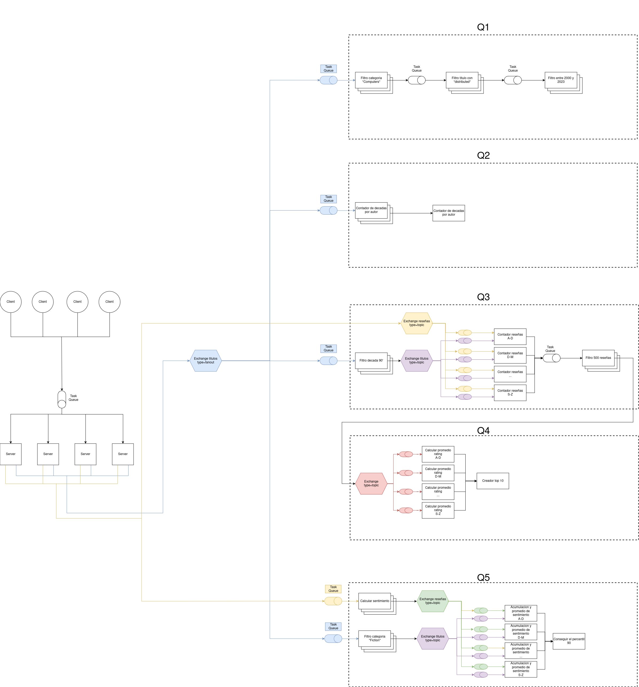 

Empezando por los clients, estos inician el servicio mandando su request y data. Estos mensajes llegaran a traves del middleware el cual juntara todos en una cola la de cual iran sacando a medida que puedan los diferentes servers. Estos ultimos, se encargaran de separar los datos como reviews o titulos y los enviaran, a traves de exchanges del middleware, a los diferentes pipelines.  

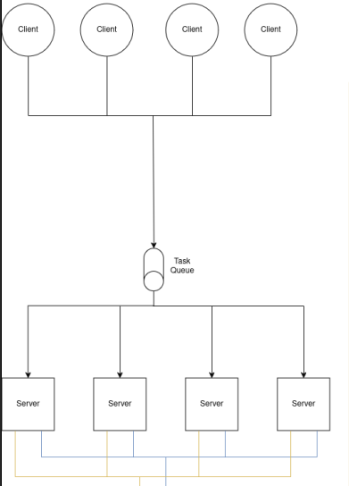 

Cada pipeline se encarga de conseguir lo resultados de una query en especifico y eso lo hacen usando diferentes tipos de workers que se encargan de aplicarle un simple tipo de "job" a cada dato recibido.  

**Query 1**: _Título, autores y editoriales de los libros de categoría "Computers" entre 2000 y 2023 que contengan 'distributed' en su título._  
Este pipeline recibe los datos de los titulos y los pasa por 3 diferentes pools de workers en los que cada pool tiene un filtro distinto a aplicar.

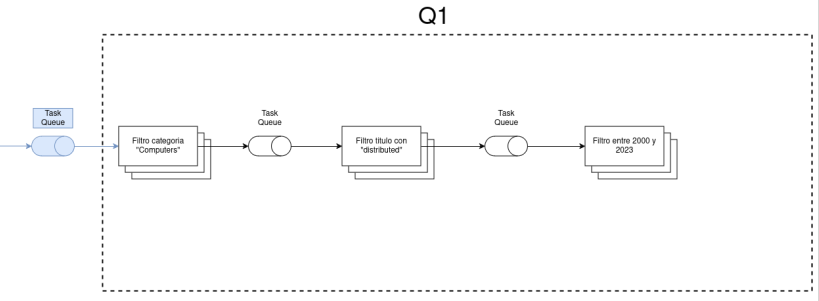 
 

**Query 2**: _Autores con títulos publicados en al menos 10 décadas distintas._  
Como en la query anterior, solo se reciben los datos de los titulos los cuale son adquiridos por un pool de workers encargado de hacer el primer filtro. A partir de eso, todos esos workers deberan comunicarle sus datos a un solo worker que acumulara los datos procesados para poder conseguir el resultado.

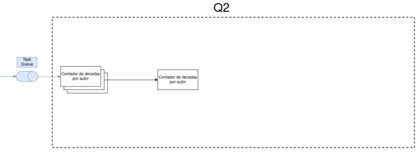 
 

**Query 3**: _Títulos y autores de libros publicados en los 90' con al menos 500 reseñas._  
Para resolver esta query se necesitan los datos de ambas tablas. Primero con un pool de workers hace el primer filtro y desde ahi se manda los titulos filtrados con un topico. Este topico sera la primer letra del titulo, de esta manera un solo worker destinado a contar reseñas de un grupo acotado de titulos recibira el titulo ya filtrado. Ademas, este ultimo worker tambien recibira reseñas a traves de un exchange con topico. De esta manera, estos workers que tienen como proposito contar las reseñas de cada titulo, recibiran titulos y sus respectivas reseñas. Cabe aclarar, que cada uno de esos no leera reseñas hasta que le termine de llegar todos los titulos. Una vez que terminan de llegar reseñas, los contadores mandan sus resultados a otro pool de workers que aplican el ultimo filtro.  

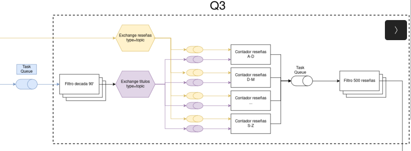 

**Query 4**: _10 libros con mejor rating promedio entre aquellos publicados en los 90’
con al menos 500 reseñas._  
En este caso se reutiliza los resultados de la query 3, y estos son mandados a traves de un exchange con topico igual a los mencionadoos en la query anterior, a workers que calculan el rating promedio. Estos luego envian tu Top 10 a un acumulador que creara el Top 10 definitivo.  

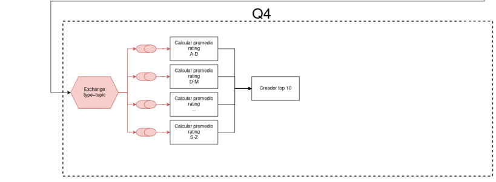 
  

**Query 5**: _Títulos en categoría "Fiction" cuyo sentimiento de reseña promedio esté en
el percentil 90 más alto._
Parecido a la query 3, se necesitan los datos de ambas tablas. Se aplica un primer filtro a los titulos y reseñas con dos pool de workers diferentes para cada uno ya que necesitan dos diferentes filtros. Despues de eso, titulos y reseñas son enviados a traves de un exchange con topico a workers que acumularan valores y generaran un promedio por cada titulo. Finalmente estos ultimos workers le mandan sus promedios a un ultimo que calculara el percentil 90.  

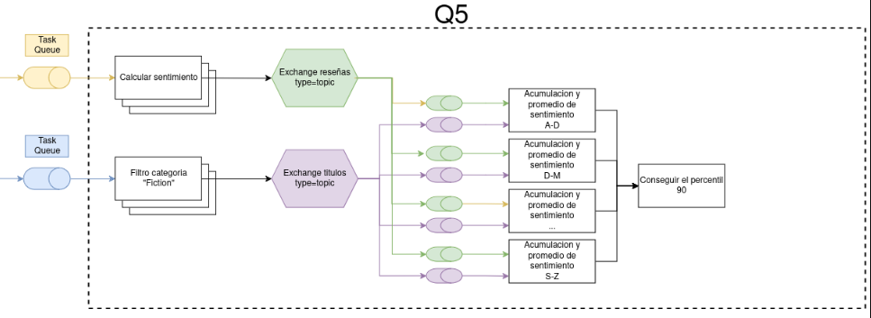 
  

##  Arquitectura C4 
La arquitectura C4 es una forma de representar la arquitectura de un sistema de software en diferentes niveles de abstracción, cada uno de los cuales se enfoca en diferentes aspectos del sistema.  
En el nivel 1 se muestra el sistema completo, en el nivel 2 se muestra el sistema dividido en containers y en el nivel 3 se muestran los componentes dentro de los containers y en el nivel 4 se observa la interacción entre el código de cada componente.  
#### **Nivel 1**

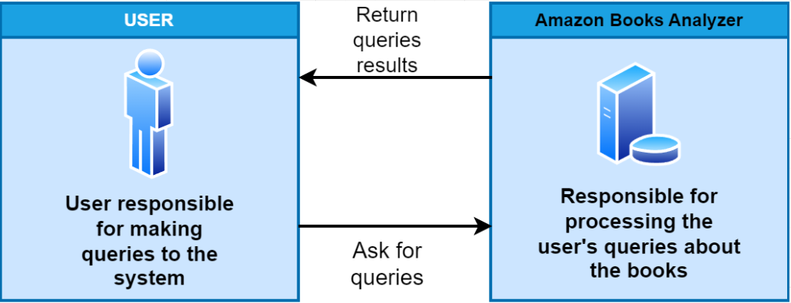 

#### **Nivel 2**

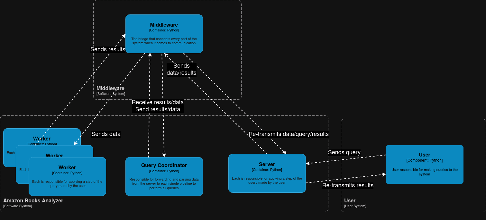 

#### **Nivel 3**

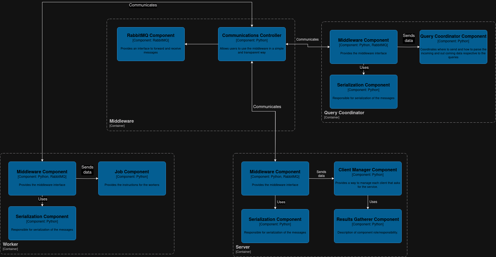 

#### **Nivel 4**

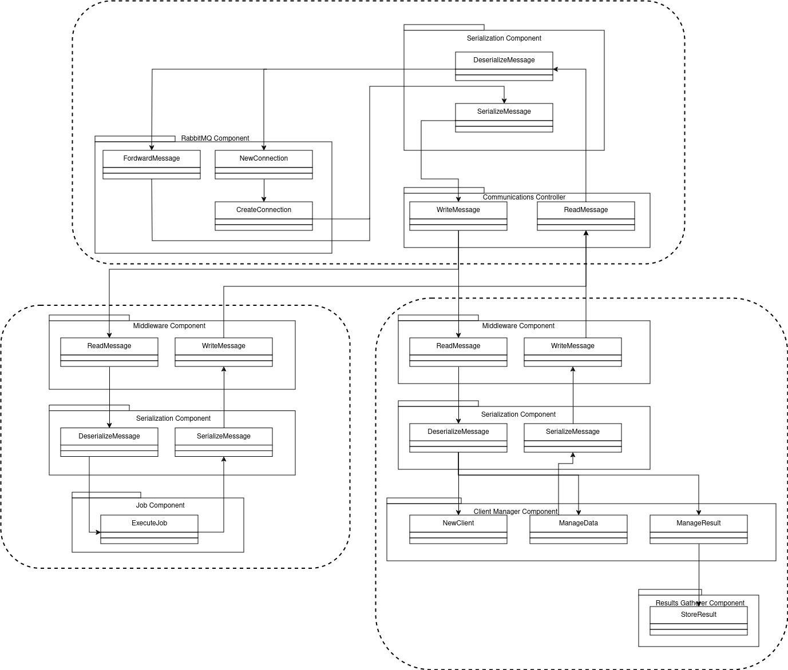 

##  Diagrama de robustez 
A continuación podemos observar el diagrama de robustez que nos indica cómo se relacionan las entidades del sistema y la manera de comunicación entre ellas mediante boundaries, controllers y entities.  
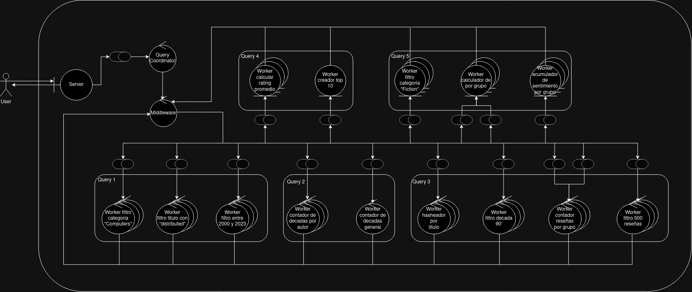

##  Diagrama de despliegue 
En el diagrama de despligue podemos ver como se agrupan los diferentes nodos del sistema en diferentes grupos y como se comunican entre ellos.

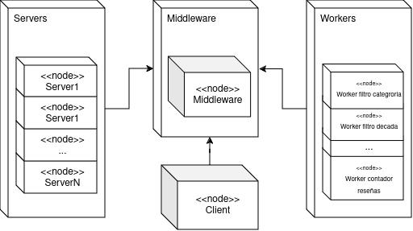 

##  Diagramas de actividad 
En los diagramas de actividad se muestra el flujo de la actividad de cada consulta en el sistema y cómo pasa un mensaje para su procesamiento entre los distintos workers y el middleware.  
#### **Diagrama de flujo**

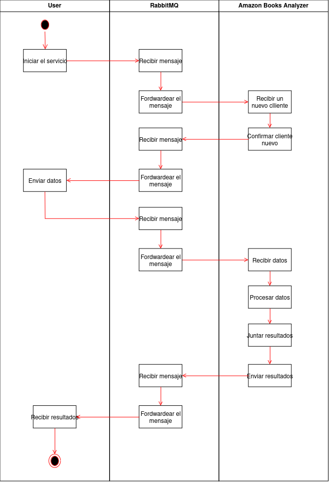 

#### **Query 1**

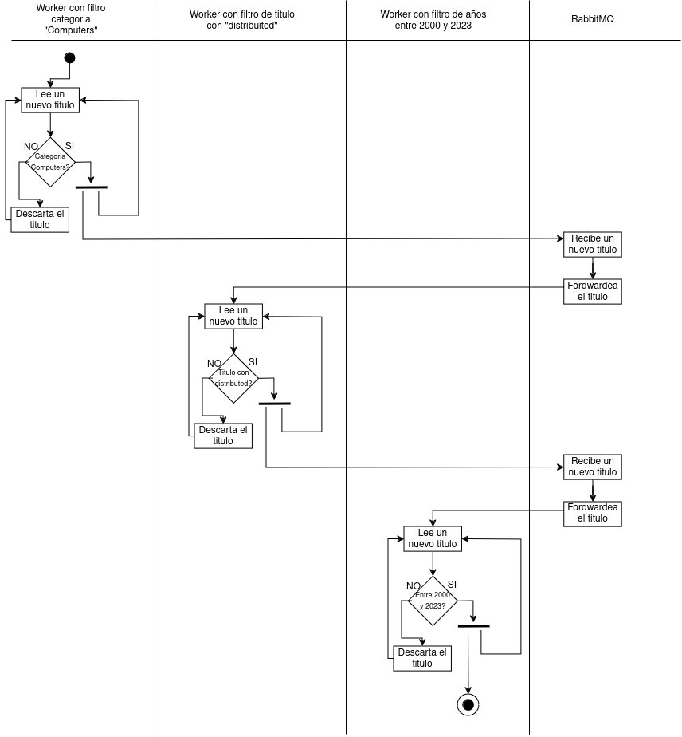 

#### **Query 2**

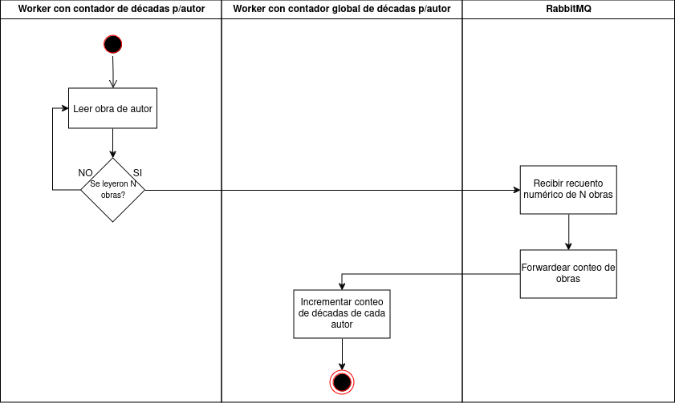 

#### **Query 3**

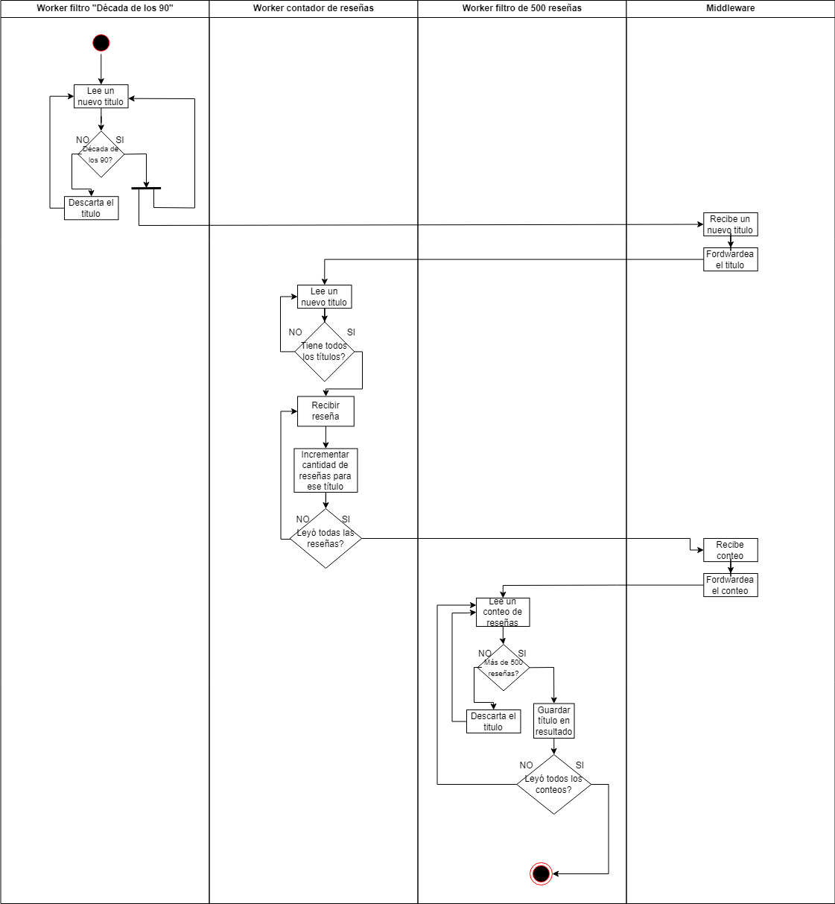 

#### **Query 4**

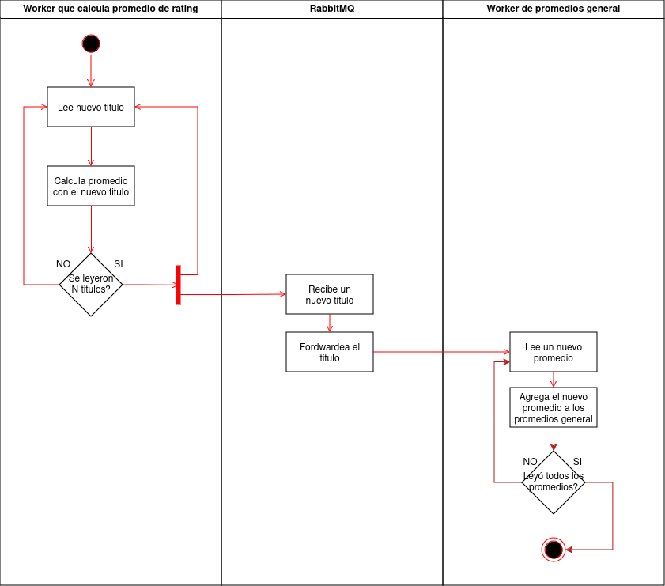 

#### **Query 5**

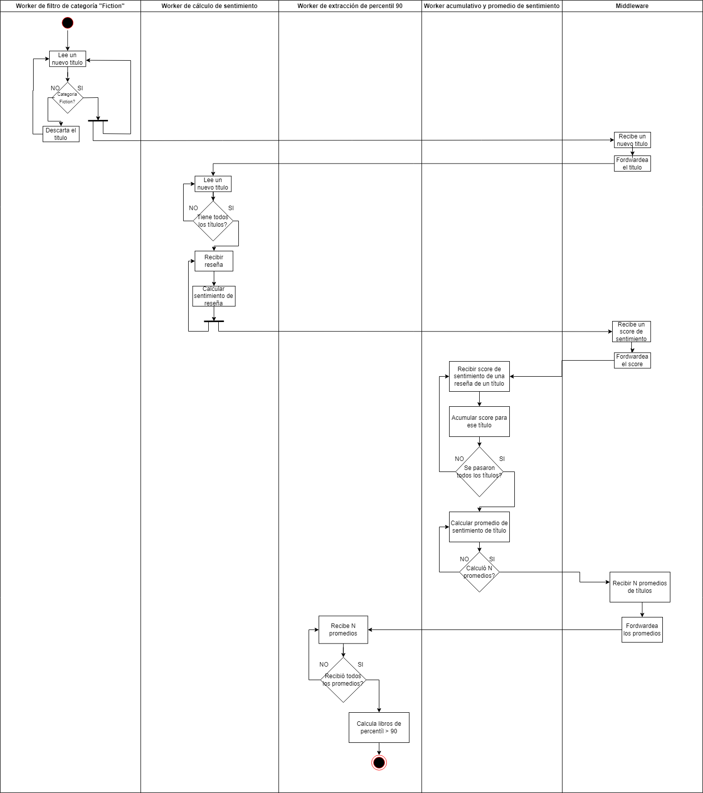 

##  División de tareas 

##  Division de tareas 
| Container  | Tarea                               | Integrante    |   |   |
|------------|-------------------------------------|---------------|---|---|
| Middleware | Protocolo de comunicacion           | Diego/Facundo |   |   |
|            | Modulo de serializacion             | Diego         |   |   |
|            | Modulo de comunicacion              | Diego/Facundo |   |   |
| Client     | Web-Scraper                         | Facundo       |   |   |
|            | Results Receiver                    | Facundo       |   |   |
| Server     | Client Manager                      | Diego         |   |   |
|            | Data redirectioner                  | Facundo       |   |   |
| Worker     | Filtro categoria                    | Diego         |   |   |
|            | Filtro titulo con "distributed"     | Facundo       |   |   |
|            | Filtro entre 2000 y 2023            | Diego         |   |   |
|            | Contador de decadas por autor       | Facundo       |   |   |
|            | Acumulador de contadores de decadas | Diego         |   |   |
|            | Filtro decada 90'                   | Facundo       |   |   |
|            | Contador reseñas                    | Diego         |   |   |
|            | Filtro 500 reseñas                  | Facundo       |   |   |
|            | Calculador promedio de rating       | Diego         |   |   |
|            | Creador top 10                      | Facundo       |   |   |
|            | Calculador de sentimiento           | Diego         |   |   |
|            | Acumulador de sentimientos          | Facundo       |   |   |
|            | Calculador del percentil 90         | Diego         |   |   |